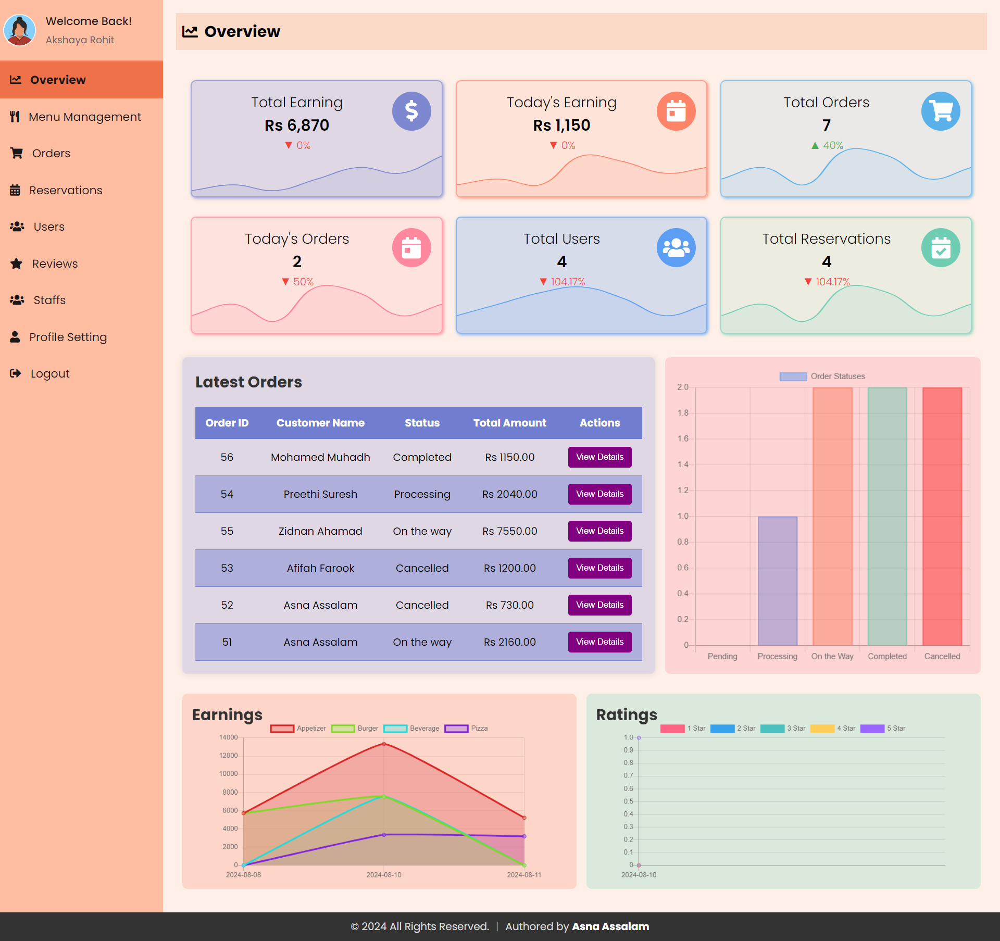

# Online Food Order System for Restaurant

An efficient and user-friendly online food ordering system designed to enhance the dining experience for customers and streamline operations for restaurant admins.

## Table of Contents

- [About](#about)
- [Features](#features)
- [Technology Stack](#technology-stack)
- [Screenshots](#screenshots)
- [Getting Started](#getting-started)
  - [Prerequisites](#prerequisites)
  - [Installation](#installation)
  - [Running the Application](#running-the-application)
  - [Access Instructions](#access-instructions)
- [Author](#author)  


## About

This project provides a comprehensive solution for restaurants to manage their menu, handle orders, and receive customer feedback. It includes a robust admin panel for managing operations and a seamless user interface for customers.
**Responsiveness**: The entire system is designed to be fully responsive, ensuring a smooth and consistent experience across all devices, including desktops, tablets, and smartphones.


## Features

### Customer Features

- **User Registration and Login**: Secure account creation and access.
- **Browse Menu Items**: Browse a categorized list of available food items with details like price, description, and images.
- **Cart Management**: Add items to the cart, adjust quantities, and remove items as needed.
- **Place Orders**: Complete your order with multiple payment options.
- **Order Tracking**:
  - **Track Order Status**: View real-time updates on the status of your orders.
  - **Order History**: Review past orders, view details, and track the status of previous orders.
  - **Review Orders**: Review and provide feedback on your orders.
- **Table Reservation**: Reserve a table for your visit by selecting a date, time, and number of guests.
- **Profile Settings**: Update personal information such as name, password, and contact details.

### Admin Features

- **Dashboard Overview**: A comprehensive view of total earnings, orders, reservations, and registered users.
- **Menu Management**: Add, update, and delete menu items, with the ability to categorize items and manage their availability.
- **Order Management**: View, update, and manage customer orders, including changing the order status.
- **Reservation Management**: Manage table reservations.
- **User Management**: View and manage registered users.
- **Review Management**: View and respond to customer feedback and reviews.
- **Profile Settings**: Update admin profile details such as name, email, and password.
- **Staff Management**: Manage staff details and their roles within the system.

## Technology Stack

- **Frontend**: HTML, CSS, JavaScript
- **Backend**: PHP
- **Database**: MySQL
- **Others**: Bootstrap for UI components, jQuery for DOM manipulation, AOS Library for scroll animation.

## Screenshots

These images are included to better illustrate the functionality and user interface of the Online Food Order System and showcase different parts of the application, including the customer interface, admin panel, and key features.

### Admin Interface Screenshot

1. **Dashboard Overview**  
   

### User Interface Screenshot

1. **User Interface Overview**  
   

For more detailed UI screenshots, please check the `UI-Screenshots` folder.

## Getting Started

### Prerequisites

Before you begin, ensure you have met the following requirements:

- **PHP**: Version 7.4 or higher.
- **MySQL**: Version 5.7 or higher.
- **Apache**: Version 2.4 or higher.
- **Composer**: (Optional) For managing PHP dependencies.

### Installation

Follow these steps to set up the project locally:

1. **Clone the repository:**

   ```bash
   git clone https://github.com/asnaassalam/online-food-ordering-system.git

2. **Navigate to the project directory:**
    
     cd online-food-order-system

3. **Set up the database**
    - Import the SQL file `restaurant.sql` located in the root of the project into your MySQL database.
    - Update the database configuration in the `db_connection.php` file with your MySQL credentials

### Running The Application
    - To run the application locally, start your Apache server and navigate to the project directory in your browser:
        http://localhost/online-food-ordering-system
        
       
## Access Instructions

### Admin Access

To log in to the admin panel:

1. **Import the SQL File**: Ensure you have imported the `restaurant.sql` file to set up the necessary tables and default data.

2. **Use Default Credentials**:
   - **Superadmin**: Use any email with the role `superadmin` and the corresponding password.
   - **Admin**: Use any email with the role `admin` and the corresponding password.

   Example credentials:
   - **Email**: `admin@gmail.com`
   - **Password**: `admin2024`

3. **Access the Admin Panel**: 

   Navigate to the following URL in your web browser:

    http://localhost/online-food-ordering-system/Admin

### User Access

To register and log in as a user:

1. **Register a New Account**: Go to the registration page and create an account using any valid email and password.

Example registration details:
- **Email**: `jhon@gmail.com`
- **Password**: `JhonP`

2. **Log In to Your Account**: Use the registered email and password to log in.

- **Email**: `user@example.com`
- **Password**: `userpassword`

3. **Access the User Interface**:

    Navigate to the following URL in your web browser:

     http://localhost/online-food-ordering-system/index.php

After logging in, you can browse the menu, add items to your cart, place orders, and view your order history.

## Author

- **[Asna Assalam](https://github.com/asnaassalam)**: Creator and developer of the Online Food Order System.
 


